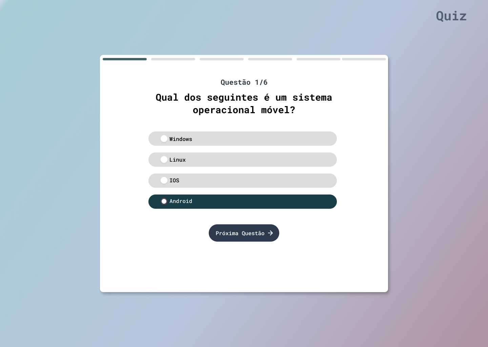

# Descrição!
Sistema de um quiz de perguntas básica usando javascript.

## ✔️ Técnicas e tecnologias utilizadas

- `Html`: estrutura e organização de texto da página principal
- `Css`: estilização da página e posicionamento dos elementos
- `Javascript`: lógica para o funcionamento do quiz para criar layout ou absorver informações e mostrar na tela.
- `Input`: campo de texto para entrada de informações
- `Button`: botões para realizar funções de iniciar quiz e ir para próxima questão.
- `DocumentQuerySelector`: selecionar tags do html para utilizar no javascript.

## ✔️ Funções Criadas.

- `createElement`: Função para criar elementos html sem precisar criar outras variaveis.
- `createOptionsForQuiz`: Função para pegar as opçoes das perguntas dentro de um array e listar na tela.
- `constructorLayoutQuiz`: Função para mostrar na tela as perguntas e com um button criado dentro da mesma com o intuito de partir para próxima pergunta.
- `resultInputRadio`: Função para comparar para contar quantas questões foram acertadas e retornar a pontuação ao final do quiz.
- `avaliableQuestionResult`: Função para mostrar os resultado quando todas as perguntas for respondida.

